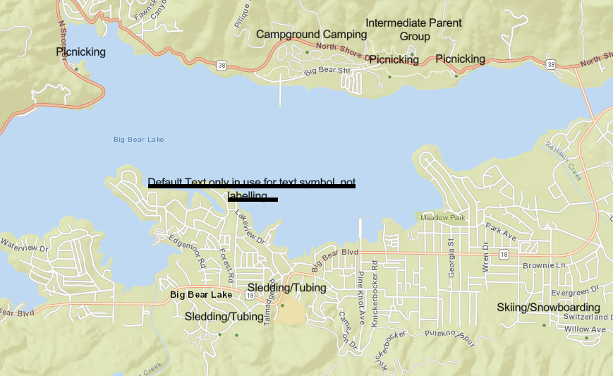
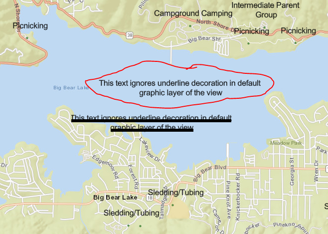

# Demo for issues with underlined labels in the Esri JavaScript 4.x API

# Setup

## Using an existing web server.

You can download this application and put it under your web server. 

## Using node.

- Install NodeJS
- Download the repository.
- Unzip
- Open the command line
- Navigate to the repository using `cd @YourPath\esri-javascript-label-issues`
- run `npm install`
- run `npm run start` to start the web server. 

This will start a web server in your command line. The file index.html can be used as a browsing starting point.

# Cases under investigation

## Case 1: Labelling does not seem to support underlined text

In the example below, the same text symbol is used to create the Graphic, and the labels. However, only the graphic's text is underlined. This is the code associated with the file `labels-underline.html`



## Case 2: Graphics with underlined text symbol behave differently in the default graphic layer associated with a map view.

The same text symbol is used for creating two graphics. One graphic is added to the default graphics layer associated with the map view, the other one to an additional graphic layer. Only the graphic in the additional graphic layer shows the text underline as defined in the Text Symbol. This is the code associated with the file `labels-underline-default-graphics.html`

```javascript

        //Text symbol creation
        var font = new Font({
              size: 12,
              family: "sans-serif",
              weight: "normal",
              style: "normal",
              decoration: "underline"
        });

        var textSymbol = new TextSymbol({
          text: "Default Text only in use for text symbol, not labelling ...",
          color: "black",
          xoffset: 3,
          yoffset: 3,
          font: font
        });

        // [...Stuff to add the map go there..]

        // The two graphics are using the same text symbol, that is underlined.
        drawingLayer.add(new Graphic({
          geometry: view.center,
          symbol: textSymbol
        }));

        view.graphics.add(new Graphic({
          geometry: new Point({x: view.center.x + 0.005, y: view.center.y + 0.005}),
          symbol: textSymbol
        }));
```


